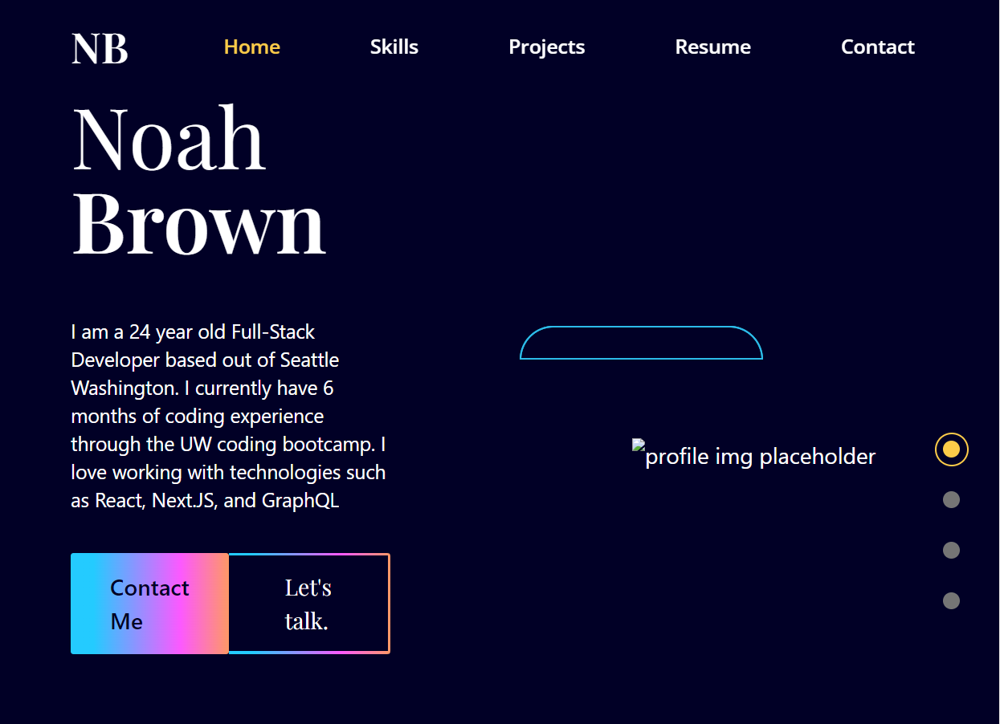
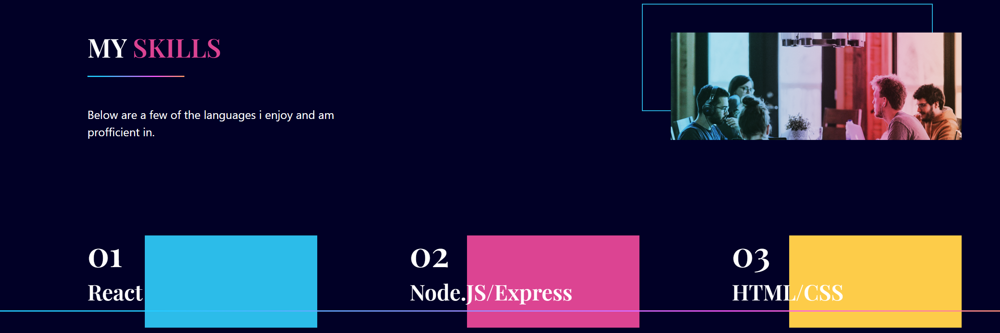
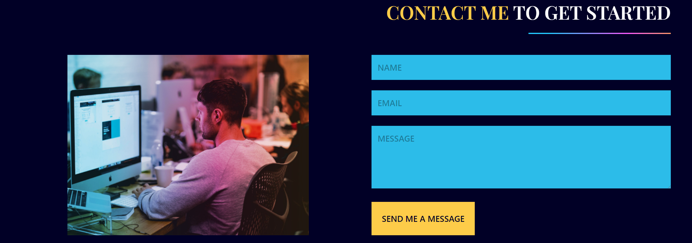

# Portfolio V 1.0.0

  
  
## Description
This is the 20th challenge for my Coding bootcamp journey. For this challenge, we had to follow acceptance criteria to create a React app portfolio to replace the portfolio we had created using barebones HTML/CSS in week 3.

This application utilizes `React` as well as `Tailwind CSS` and the `framer motion` package to handle dynamic div elements.

-TODO: Currently I am working on adding a picture of myself to the landing screen. 

-TODO: Working on fixing the project pictures / display in the projects section.

-TODO: Will Add a Resume to my Portfolio once its updated.

## Table of Contents
* [Description](#description)
* [Usage](#usage)
* [Questions](#questions)
  
  
## Usage
Below are some screenshots of the deployed application.

You can view the deployed application [here](https://noahbrown26.github.io/Portfolio-1.0.0/)
  
## Questions
Any Questions? Please reachout to me at Noahbrown2663@gmail.com
In addition, you can view this project and others on my [GitHub](https://github.com/Noahbrown26)
